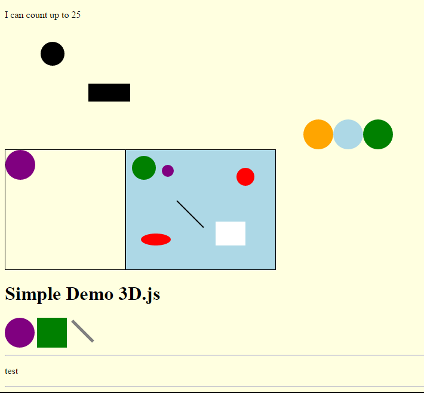

# Demo Simple usage of d3.js 

# Sample Screen 

Attribute | Value 
--- | --- 
Coder | Thitipong Samranvanich
Since | 8 Feb 2017 
Location | GMT + 7 
Status |  Partial Finish / Under Developement 
Requirement | Web Server must start , Internet connection must Exist ( Use CDN for d3.js )
Test Environment | Windows 10 , Google Chrome , Apache Web Server on XAMPP 

